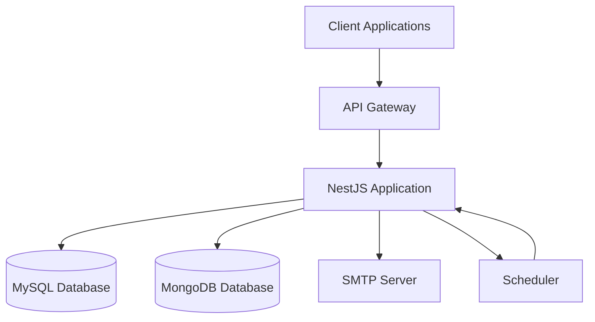
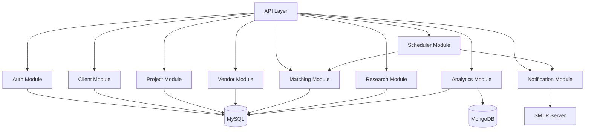
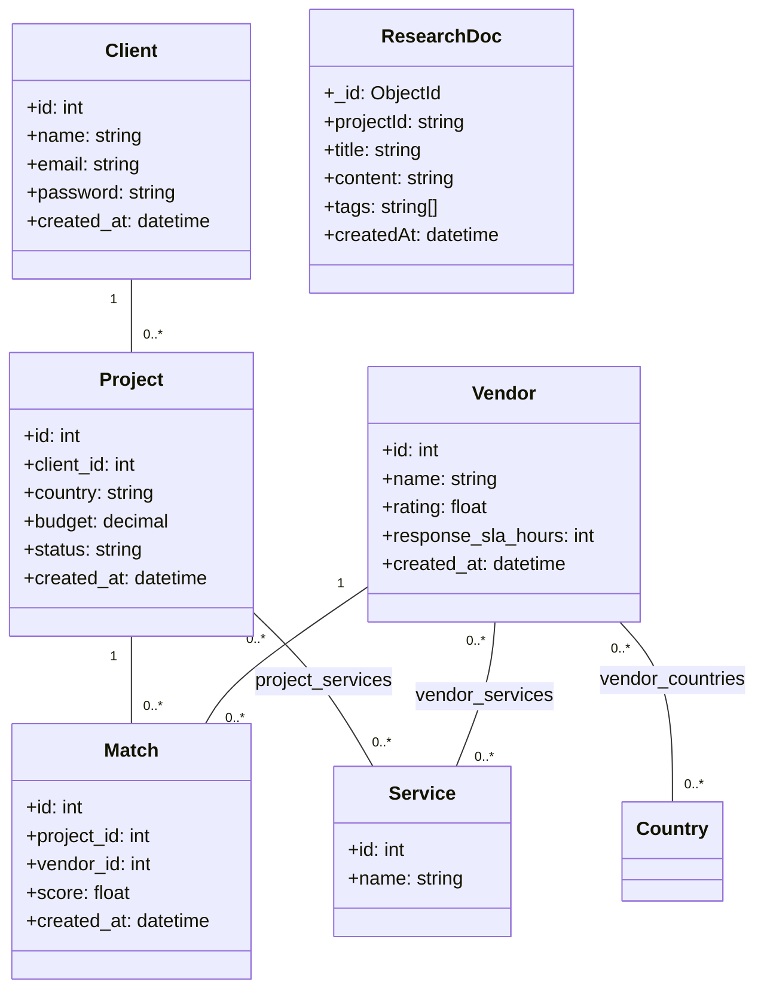
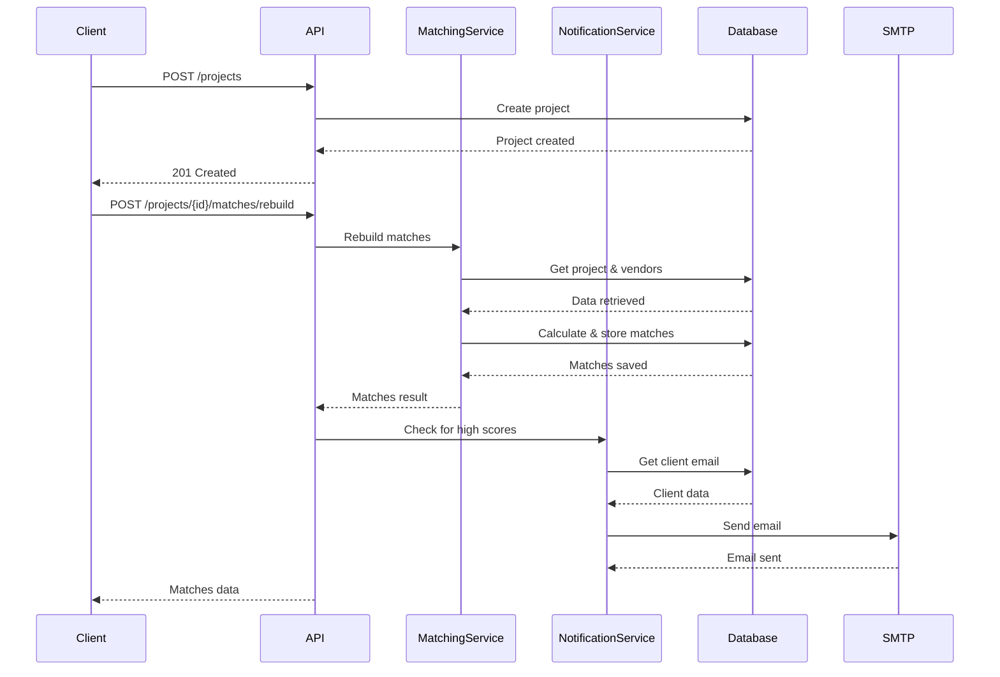
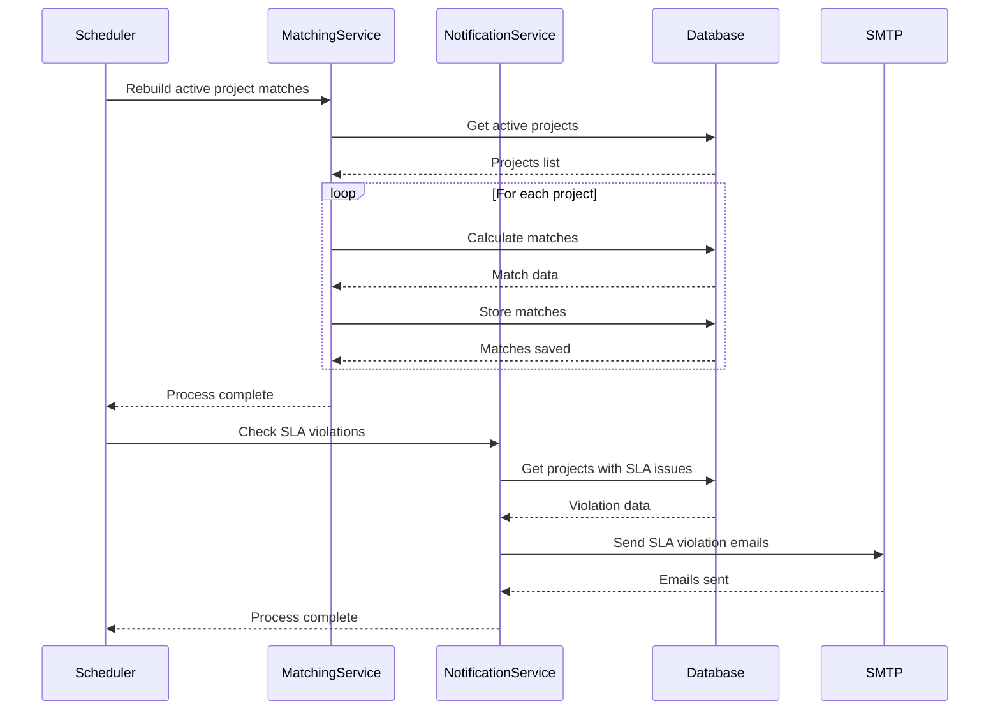

# System Design

## Context and Goals

The Expansion Management System is designed to help organizations manage client projects, match them with appropriate vendors, and provide analytics on vendor performance. The system aims to:

1. Provide a centralized platform for project and vendor management
2. Automate vendor-project matching based on business rules
3. Enable research document storage and retrieval
4. Offer analytics on vendor performance
5. Send notifications for important events
6. Ensure data consistency and security

## Architecture Overview



### Component Diagram



## Data Model



## Sequence Diagrams

### Create Project → Rebuild Matches → Notify Client



### Daily Job → Recalculate → SLA Check



## Matching Algorithm

### Rationale

The matching algorithm is designed to provide relevant vendor recommendations based on:

1. **Geographic proximity**: Vendors must be in the same country as the project
2. **Service alignment**: Vendors must provide at least one service that the project requires
3. **Performance metrics**: Vendor rating and response SLA are factored into the score

### Formula

The matching score is calculated as:

```
Score = (Overlap Count × 2) + Vendor Rating + SLA Weight

Where:
- Overlap Count = Number of services that match between project and vendor
- Vendor Rating = Vendor's rating (0-5 scale)
- SLA Weight = max(0, 10 - response_sla_hours/24)
```

### Complexity

- Time Complexity: O(V × S) where V is the number of vendors in the country and S is the average number of services per vendor
- Space Complexity: O(M) where M is the number of matches generated

### Edge Cases

1. **No matching vendors**: Returns empty result set
2. **No overlapping services**: Score is based only on rating and SLA
3. **Vendors with no rating**: Rating component is zero
4. **Vendors with no SLA**: SLA component is zero

### Idempotency

The matching algorithm is idempotent - running it multiple times with the same inputs will produce the same results. Matches are upserted based on the unique constraint (project_id, vendor_id).

## Security

### Authentication

- JWT tokens for API authentication
- Password hashing with bcrypt
- Role-based access control (client, admin)

### Authorization

- Route-level guards for role-based access
- Data isolation by client ownership
- Admin-only access to certain endpoints

### Validation

- Input validation on all endpoints
- Sanitization of user inputs
- Parameterized database queries

### Rate Limiting

- API rate limiting to prevent abuse
- Brute force protection for login

### CORS

- Configured CORS policies for web applications

## Scalability Considerations

### Read/Write Patterns

- **Read-heavy**: Analytics, vendor listings, project details
- **Write-moderate**: Project creation, vendor matching, research docs

### Indexing Strategy

1. **MySQL**:
   - Primary keys on all ID columns
   - Foreign key indexes
   - Unique constraint on (project_id, vendor_id) in matches
   - Indexes on frequently queried columns (country, status)

2. **MongoDB**:
   - Text index on (title, content) for search
   - Compound index on (projectId, tags) for filtering

### Caching Plan

- Redis caching for:
  - Frequently accessed vendor lists
  - Analytics data
  - User sessions

## Observability

### Logging

- Structured logging with request IDs
- Error logging with stack traces
- Audit trails for important operations

### Request IDs

- Unique request IDs for tracing
- Correlation across services

### Metrics

- API response times
- Database query performance
- Error rates
- System resource usage