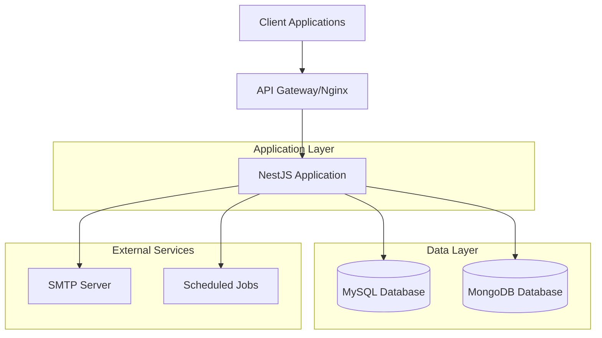
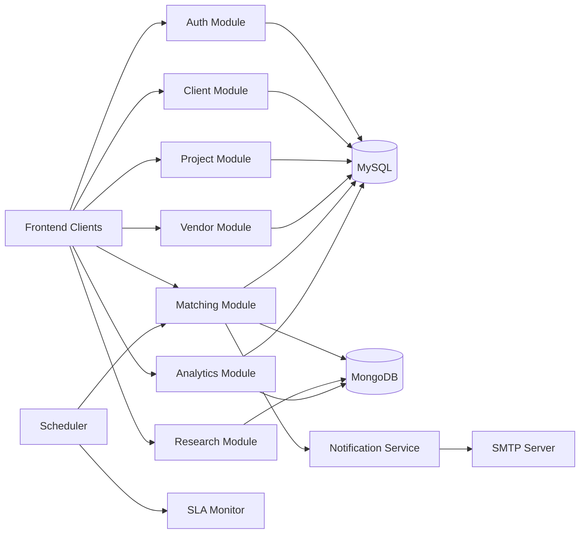
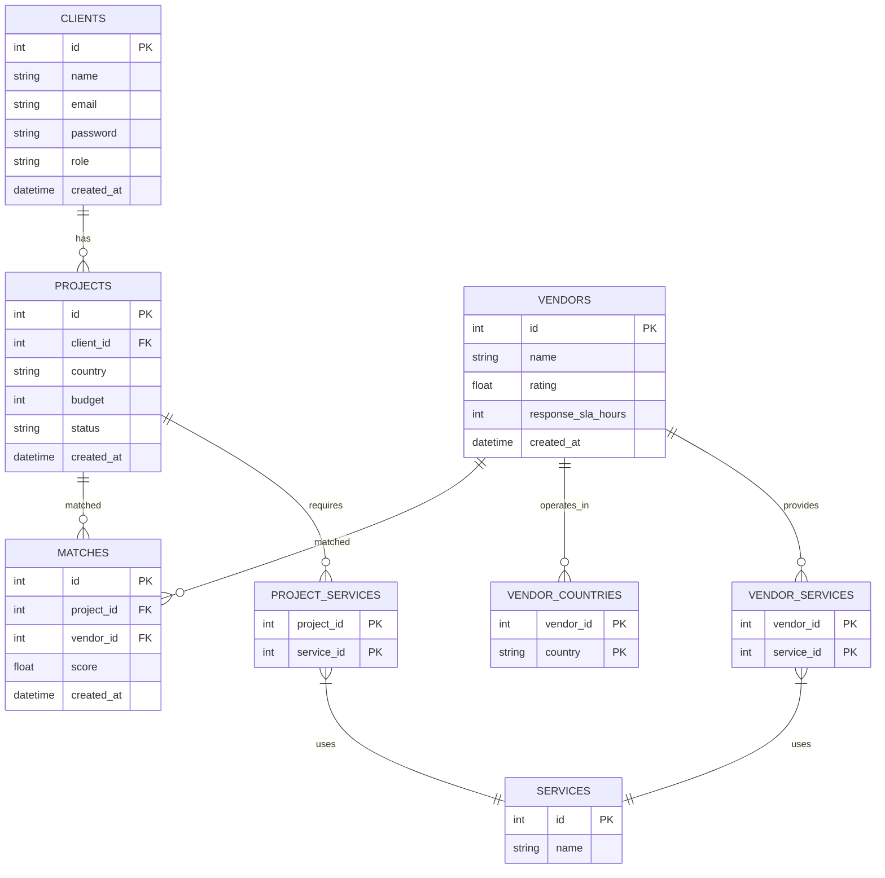
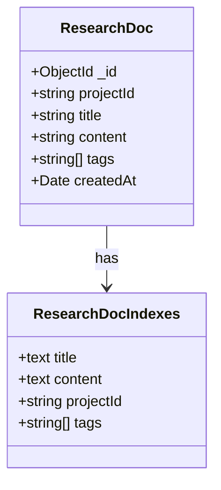
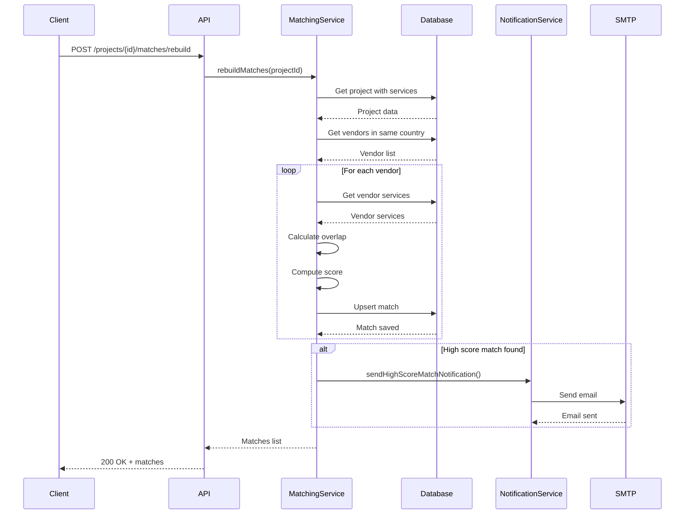
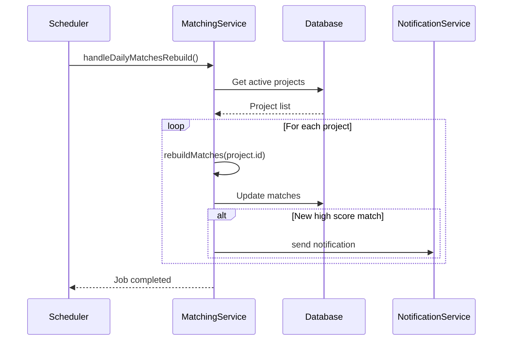
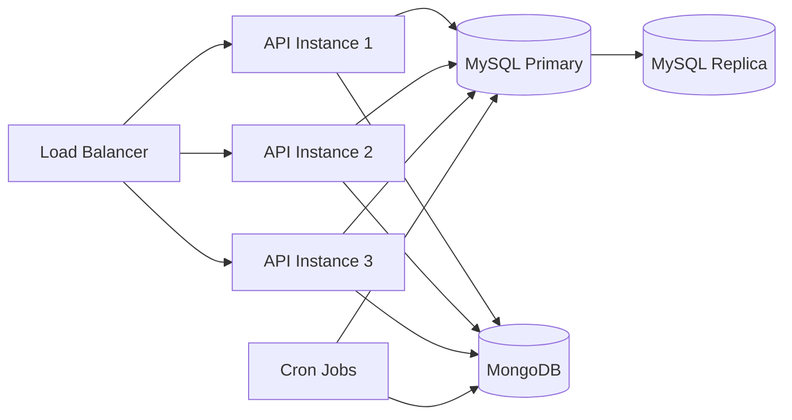

# System Design

## Context and Goals

The Expansion Management System is designed to streamline client project management, vendor matching, and analytics for business expansion operations. The system enables organizations to efficiently match vendors with client projects based on geographic and service capabilities, improving operational efficiency and decision-making.

### Business Goals

1. Automate vendor-client matching processes based on country and service overlap
2. Centralize vendor and project data in a single system
3. Scale matching logic across multiple countries and services
4. Provide analytics and notification systems for high-potential matches
5. Enable research document storage and full-text search capabilities

### Technical Goals

1. Build a maintainable and scalable backend using NestJS
2. Implement dual-database strategy for optimal data modeling
3. Provide comprehensive API documentation with examples
4. Ensure security with JWT authentication and role-based access control
5. Implement automated testing and CI/CD pipelines

## Architecture Overview



### Component Diagram



## Data Model

### MySQL Schema (ERD)



### MongoDB Schema



## Matching Algorithm

The core of the system is the vendor-project matching algorithm that scores potential matches based on:

1. **Service Overlap**: Number of services that match between vendor and project
2. **Vendor Rating**: Quality score of the vendor
3. **SLA Weight**: Response time factor

### Scoring Formula

```
score = (overlapCount * 2) + vendor.rating + SLA_weight
SLA_weight = max(0, 10 - response_sla_hours/24)
```

### Sequence Diagram: Matching Process



### Sequence Diagram: Daily Job



## Security

### Authentication

- JWT-based authentication with role-based access control
- Two roles: `client` and `admin`
- Password hashing with bcrypt
- Secure token expiration

### Authorization

- Route-level guards for role-based access
- Admin-only endpoints for sensitive operations
- Client-scoped data access

### Data Protection

- Environment variables for secrets
- Input validation and sanitization
- SQL injection prevention through ORM
- Rate limiting to prevent abuse

## Scalability Considerations

### Read/Write Patterns

- High read frequency for project and vendor data
- Moderate write frequency for matches and research docs
- Periodic batch processing for analytics

### Indexing Strategy

- Primary keys on all entity IDs
- Foreign key indexes for relationships
- Composite indexes for frequent query patterns
- Text indexes for MongoDB research documents

### Caching Plan

- In-memory caching for frequently accessed data
- Redis integration for distributed caching
- Cache invalidation on data updates

## Observability

### Logging

- Structured logging with request IDs
- Error logging with stack traces
- Performance monitoring logs

### Metrics

- API response times
- Database query performance
- Match computation statistics
- Email delivery metrics

### Health Checks

- Database connectivity
- External service availability
- Application responsiveness

## Deployment Architecture



This deployment architecture supports horizontal scaling of the API layer while maintaining consistent data access patterns.